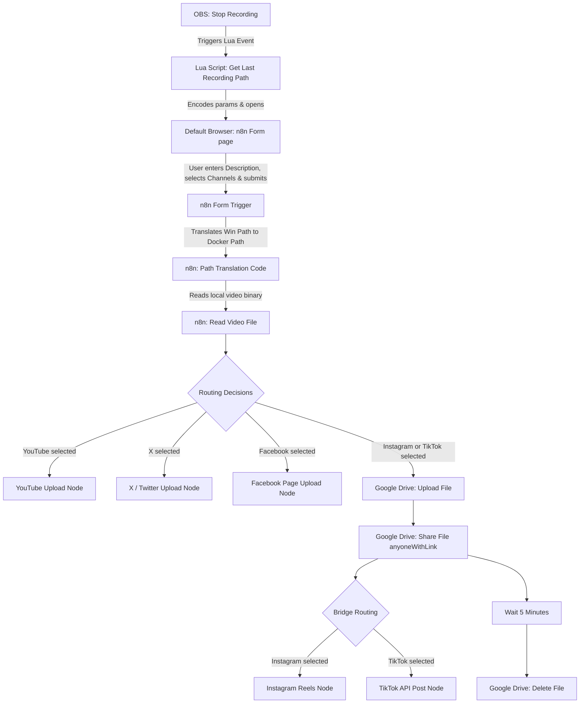
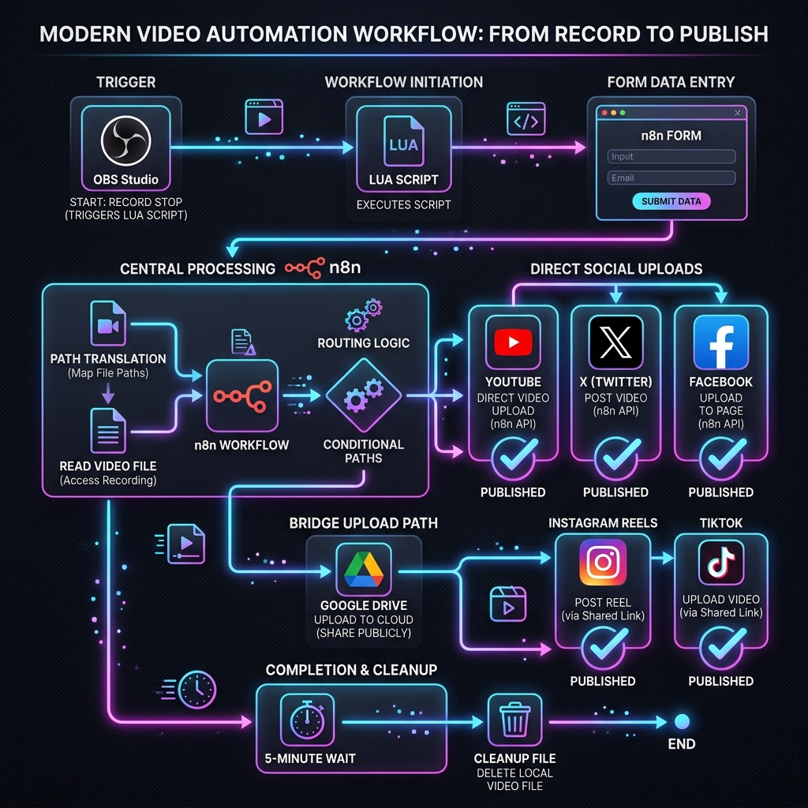

# 🎬 n8n-obs2socials: Automatic OBS Recording Uploads to YouTube, Instagram, TikTok, X, & Facebook

A seamless, self-hosted automation pipeline to instantly upload your OBS Studio recordings to YouTube, Instagram Reels, TikTok, X (formerly Twitter), and Facebook Pages using a local [n8n](https://n8n.io/) instance, Google Drive (as an asset bridge), and a Lua script.

When you stop recording in OBS, a browser tab is automatically launched. It pre-fills an n8n-hosted form with your recording's file path and title. You check which platforms you want to post to, type a caption/description, and submit!



### 📊 Workflow Diagram


---

## 📂 Project Structure

This project consists of three core components:

*   [obs_to_n8n.lua](file:///c:/Users/phucl/OneDrive/Desktop/phuc/Projects/n8n-obs2yt/obs_to_n8n.lua) – An OBS script that handles the stop-recording event and launches the browser with URL query parameters.
*   [docker-compose.yml](file:///c:/Users/phucl/OneDrive/Desktop/phuc/Projects/n8n-obs2yt/docker-compose.yml) – Spins up a self-hosted n8n Docker container with directory mounting configured for access to recordings.
*   [n8n_youtube_upload_workflow.json](file:///c:/Users/phucl/OneDrive/Desktop/phuc/Projects/n8n-obs2yt/n8n_youtube_upload_workflow.json) – The multi-channel n8n workflow template containing the Form trigger, path translation, file reader, branching conditional logic, Google Drive bridge, and social media integration nodes.

---

## 🚀 Setup Instructions

Follow these steps to set up the automation pipeline.

### Step 1: Spin up the n8n Container
The workflow reads files directly from your disk, so the n8n instance must run in a container that has access to your Windows video directory.

1. Open your terminal in the project directory.
2. Edit [docker-compose.yml](file:///c:/Users/phucl/OneDrive/Desktop/phuc/Projects/n8n-obs2yt/docker-compose.yml) to verify or update the volume mount to point to your OBS recordings folder. By default, it maps:
   ```yaml
   - C:/Users/phucl/Videos:/recordings
   ```
   If your videos are saved elsewhere (e.g., `D:/OBS/Recordings`), update the left side of the colon: `D:/OBS/Recordings:/recordings`.
3. Start the container:
   ```bash
   docker-compose up -d
   ```
4. Access n8n by navigating to `http://localhost:5678` in your browser.

---

### Step 2: Import the n8n Workflow
1. In the n8n dashboard, create a new workflow.
2. Click the **Import from File** option in the top right menu and select [n8n_youtube_upload_workflow.json](file:///c:/Users/phucl/OneDrive/Desktop/phuc/Projects/n8n-obs2yt/n8n_youtube_upload_workflow.json).
3. **Configure Path Translation (Optional)**:
   Double-click the **Path Translation** node. If you modified the Windows recordings directory in Step 1, update the regex replace line to match your Windows path:
   ```javascript
   // Translate path to docker container path
   dockerPath = dockerPath.replace(/^C:\/Users\/phucl\/Videos/i, '/recordings');
   ```
4. **Get the Form Trigger URL**:
   Open the **n8n Form Trigger** node. Copy the **Production URL** (or Test URL if you're testing it).
5. Click **Active** to activate the workflow.

---

### Step 3: Configure the Lua Script in OBS
1. Open OBS Studio.
2. Go to **Tools** -> **Scripts** in the top menu.
3. Click the `+` sign and add [obs_to_n8n.lua](file:///c:/Users/phucl/OneDrive/Desktop/phuc/Projects/n8n-obs2yt/obs_to_n8n.lua).
4. Select the script in the list to reveal its configuration properties:
   *   **n8n Form URL**: Paste the n8n form URL you copied in Step 2.
   *   **Open Browser on Stop**: Enable this checkbox.
5. Close the Scripts window.

---

## 🔑 Credential Setup & Node Configuration

Different platforms have different requirements. Follow this guide to set up credentials for the channels you select.

### 1. Google Drive (Cloud Bridge)
> [!IMPORTANT]
> **Why is this needed?** The Meta API (Instagram) and TikTok API do not allow uploading video files directly as binary from a private local server behind NAT. Instead, they require a **publicly accessible URL** to fetch/pull the video.
> This workflow uploads the video to Google Drive, sets it to "Anyone with link can read", triggers the upload, waits 5 minutes, and then automatically deletes the file.

*   **Setup**: In n8n, create a Google Drive connection. Enable Google Drive API in your Google Developer Console and authorize access to your Google account.
*   **Direct Download construction**: The workflow automatically constructs the direct download link using:
    `https://drive.google.com/uc?export=download&id={{ $('Google Drive Upload').item.json.id }}`

### 2. YouTube
*   **Node**: YouTube Node.
*   **Setup**: Uses standard OAuth2. Connect it to your Google account associated with your YouTube channel. Make sure to enable the YouTube Data API v3 in your Google Developer Console.

### 3. X (Twitter)
*   **Node**: X (Twitter) Node.
*   **Setup**: Select `OAuth2` authentication. Ensure your X Developer Portal project has User Authentication enabled with **Web App/OAuth 2.0** settings and the `tweet.write` scope checked.

### 4. Facebook Pages
*   **Node**: Facebook Page Node.
*   **Setup**: Connect your Facebook Account. Select your Page from the dropdown. The Page must grant publish permissions for videos.

### 5. Instagram Reels
*   **Node**: Instagram Reels (Facebook Graph API) Node.
*   **Setup**: Meta requires an Instagram Business Account linked to a Facebook Page. Configure OAuth2 using your Meta Developer App and select the Page and Instagram Business Account.

### 6. TikTok
*   **Node**: TikTok Upload (HTTP Request) Node.
*   **Setup**: Configured to call `/v2/post/publish/video/init/` using the `PULL_FROM_URL` method. It passes the Google Drive direct download URL. You will need to link your TikTok Creator Account via OAuth2 in n8n's Generic Credential manager.

---

## 🛠️ How It Works under the Hood

1. **Recording Stop**: OBS calls `on_event` in [obs_to_n8n.lua](file:///c:/Users/phucl/OneDrive/Desktop/phuc/Projects/n8n-obs2yt/obs_to_n8n.lua) when recording ends.
2. **Browser Opens Form**: The Lua script launches your browser pointing to the n8n form, passing `video_path` and `title` via query parameters.
3. **Form Selection**: You choose which social networks to target (YouTube, Instagram, TikTok, X, Facebook) and write a caption.
4. **Conditional Routing**:
   *   **YouTube, X, and Facebook** receive direct binary file uploads from your local storage.
   *   **Instagram and TikTok** trigger the Google Drive bridge path, transferring the file to cloud storage temporarily to provide a public URL.
5. **Bridge Cleanup**: The workflow starts a 5-minute timer (Wait node) to allow Instagram and TikTok servers to pull the video before calling the Google Drive node to delete the video.
