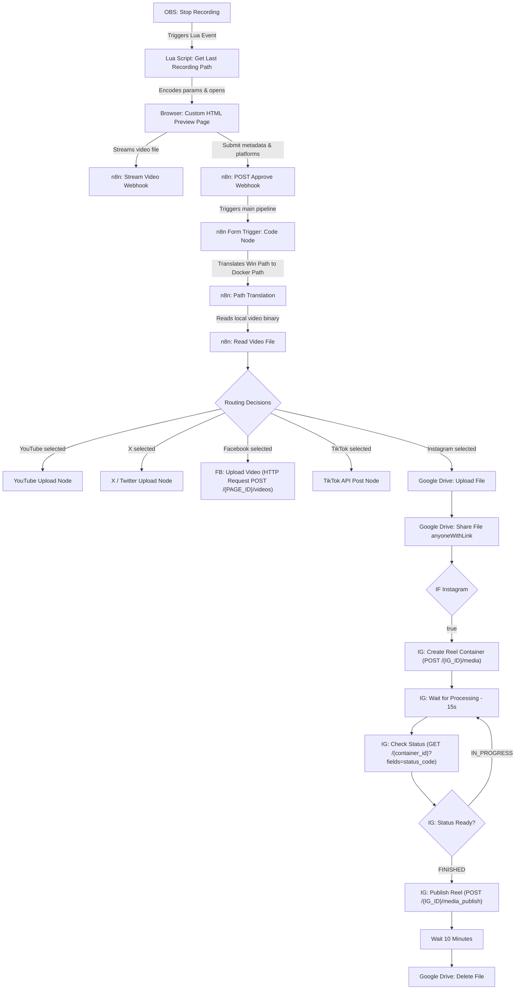

# 🎬 n8n-obs2socials: Automatic OBS Recording Uploads to YouTube, Instagram, TikTok, X, & Facebook

A seamless, self-hosted automation pipeline to instantly upload your OBS Studio recordings to YouTube, Instagram Reels, TikTok, X (formerly Twitter), and Facebook Pages using a local [n8n](https://n8n.io/) instance, Google Drive (as an asset bridge), and a Lua script.

When you stop recording in OBS, a browser tab is automatically launched. It opens a custom, modern HTML preview page hosted by your local n8n instance, streaming your recording directly from your disk using an HTML5 video player. You can review the video, customize the title, write a caption/description, select target platforms, and submit to publish!



### 📊 Workflow Diagram


---

## 📂 Project Structure

This project consists of three core components:

*   [obs_to_n8n.lua](./obs_to_n8n.lua) – An OBS script that handles the stop-recording event and launches the browser with URL query parameters.
*   [docker-compose.yml](./docker-compose.yml) – Spins up a self-hosted n8n Docker container with directory mounting configured for access to recordings.
*   [socials_upload.json](./socials_upload.json) – The multi-channel n8n workflow template containing the Form trigger, path translation, file reader, branching conditional logic, Google Drive bridge, and social media integration nodes.

---

## 🚀 Setup Instructions

Follow these steps to set up the automation pipeline.

### Step 1: Spin up the n8n Container
The workflow reads files directly from your disk, so the n8n instance must run in a container that has access to your Windows video directory.

1. Open your terminal in the project directory.
2. Edit [docker-compose.yml](./docker-compose.yml) to verify or update the volume mount to point to your OBS recordings folder. By default, it maps:
   ```yaml
   - C:/Users/phucl/Videos/OBS:/recordings
   ```
   If your videos are saved elsewhere (e.g., `D:/OBS/Recordings`), update the left side of the colon: `D:/OBS/Recordings:/recordings`.
3. Start the container:
   ```bash
   docker-compose up -d
   ```
4. Access n8n by navigating to `http://localhost:5678` in your browser.

---

### Step 2: Import the n8n Workflow
1. In the n8n dashboard, create a new workflow.
2. Click the **Import from File** option in the top right menu and select [socials_upload.json](./socials_upload.json).
3. **Automatic Path Translation**:
   The workflow is designed to translate paths dynamically. It extracts the filename from the Windows path sent by OBS and automatically maps it to `/recordings/<filename>` inside Docker. No manual configuration inside n8n is required!
4. **Get the Preview Webhook URL**:
   Open the **Webhook GET: obs-preview** node. Copy the **Production URL** (or Test URL if you are testing/debugging the workflow).
5. Click **Active** to activate the workflow.

---

### Step 3: Configure the Lua Script in OBS
1. Open OBS Studio.
2. Go to **Tools** -> **Scripts** in the top menu.
3. Click the `+` sign and add [obs_to_n8n.lua](./obs_to_n8n.lua).
4. Select the script in the list to reveal its configuration properties:
   *   **n8n Preview URL**: Paste the preview webhook URL you copied in Step 2. (e.g. `http://localhost:5678/webhook/obs-preview`).
   *   **Open Browser on Stop**: Enable this checkbox.
5. Close the Scripts window.

---

## 🔑 Credential Setup & Node Configuration

For all platforms using **OAuth2** authentication in your local n8n instance, you must configure the developer portals with n8n's callback URL.
*   **n8n OAuth2 Redirect URI:** `http://localhost:5678/rest/oauth2-credential/callback`

---

### 1. Google Drive (Cloud Bridge) & YouTube (Google Cloud Console)
> [!IMPORTANT]
> **Why is Google Drive needed?** Meta (Instagram) and TikTok APIs do not allow direct binary uploads from a private local server behind NAT. They require a **publicly accessible URL** to download the video. The workflow uploads the video to Google Drive, shares it publicly, triggers the upload to those platforms, waits 5 minutes, and then deletes it automatically.

Both Google Drive and YouTube credentials are set up using **Google Cloud Console**:
1.  Go to the [Google Cloud Console](https://console.cloud.google.com/).
2.  Create a new project (e.g., `n8n-obs-uploader`).
3.  Go to **Enabled APIs & Services** and click **Enable APIs and Services**. Search and enable:
    *   **Google Drive API**
    *   **YouTube Data API v3**
4.  Go to **OAuth consent screen**:
    *   Choose **External** user type.
    *   Fill in required app details.
    *   Under **Scopes**, add `.../auth/drive` (Google Drive API) and `.../auth/youtube.upload` / `.../auth/youtube` (YouTube Data API).
    *   Under **Test users**, add your own Google email address (so your app can log in while in testing mode).
5.  Go to **Credentials** -> **Create Credentials** -> **OAuth client ID**:
    *   Application Type: **Web application**.
    *   Name: `n8n Local`.
    *   Authorized redirect URIs: Add `http://localhost:5678/rest/oauth2-credential/callback`.
6.  Copy the generated **Client ID** and **Client Secret**.
7.  In n8n:
    *   For **Google Drive Upload/Share/Delete** nodes: Add new **Google Drive OAuth2** credentials and input your Client ID and Client Secret. Click to authenticate with your Google account.
    *   For **YouTube** node: Add new **YouTube OAuth2** credentials and input the Client ID and Client Secret. Connect your account.

---

### 2. X (Twitter Developer Portal)
1. Go to the [X Developer Console](https://developer.twitter.com/).
2. On the left menu, click **Apps**.
3. Under the **Development** environment, either use an existing active app or click **Create App** (in the top-right corner) / **+ New app** to create a new one.
4. Click on your active application (or click the details arrow `>` next to it) to open its settings.
5. Scroll down to **User Authentication Settings** and click **Set up** (or **Edit**):
   * **App permissions**: Select **Read and Write** (required for posting tweets and uploading videos).
   * **Type of App**: Select **Web App, Automated App or Bot**.
   * **Callback URI / Redirect URL**: `http://localhost:5678/rest/oauth2-credential/callback`
   * **Website URL**: A public URL (e.g., your GitHub repository URL like `https://github.com/GitGud031005/n8n-obs2socials` or `https://n8n.io`). X does not allow `localhost` in the Website URL field.
6. Save the settings. Copy the generated **Client ID** and **Client Secret** (OAuth 2.0).
7. In n8n, create a new **X (Twitter) OAuth2 API** credential, enter the Client ID and Client Secret, and click to authorize.

---

### 3. Facebook Pages & Instagram Reels (Meta for Developers)
Both Facebook and Instagram Reels integrations use the **Facebook Graph API** node. It is highly recommended to use **Token-based authentication (Facebook Page API)** instead of OAuth2. Meta's latest Graph API versions have deprecated several default scopes requested by n8n's built-in OAuth2 flow, causing an "Invalid Scopes" error during authorization.

Follow these detailed steps to generate a permanent access token and connect your account:

#### Step 1: Create a Meta App & Add Use Cases
1. Go to [Meta for Developers](https://developers.facebook.com/) and register as a developer.
2. Create a new App. Under the **Add use cases** (Thêm trường hợp sử dụng) setup:
   * Select **Quản lý hoạt động nhắn tin và nội dung trên Instagram** (Instagram Messaging and Content Management) for Instagram Reels.
   * Select **Quản lý mọi thứ trên Trang** (Page Management) for Facebook Pages.
   * When asked to connect a business profile (Bạn muốn kết nối hồ sơ doanh nghiệp nào...), choose **Tôi chưa muốn kết nối hồ sơ doanh nghiệp** (I don't want to connect a business profile yet) if you are setting up for personal use.

#### Step 2: Generate a Short-Lived Access Token
1. Go to the [Meta Graph API Explorer](https://developers.facebook.com/tools/explorer/).
2. In the top-right **Meta App** dropdown, select your newly created app (e.g., `n8n-obs2socials`).
3. Under the **User or Page** dropdown, select **Get Page Access Token**.
4. A Facebook login popup will appear. Select the Facebook Pages and Instagram Business accounts you want to use, ensure all permissions are checked, and complete the login.
5. In the **Permissions** panel on the right, ensure the following scopes are listed:
   * `pages_show_list`
   * `pages_read_engagement`
   * `pages_manage_posts`
   * `instagram_basic`
   * `instagram_content_publish`
   *(If any are missing, search for them in the Permissions search box and add them).*
6. Click the blue **Generate Access Token** button. Copy the generated token from the **Access Token** field.

#### Step 3: Convert to a Permanent Page Access Token
Tokens generated from the Explorer expire in 2 hours. Follow these steps to generate a permanent token that never expires:
1. Click the blue info icon **(i)** next to the Access Token field.
2. Click **Open in Access Token Tool** (Mở trong công cụ mã truy cập).
3. Scroll to the bottom of the tool page and click **Extend Access Token** (Kéo dài mã truy cập). Re-authenticate if prompted.
4. Copy the newly generated **Long-Lived User Access Token**.
5. Go back to the [Graph API Explorer](https://developers.facebook.com/tools/explorer/) and paste this long-lived token into the **Access Token** field.
6. In the query address bar (next to `GET`), replace whatever is there with: `me/accounts` and click the **Submit** button on the right.
7. Under the JSON response, find your target Page name. Copy **two values**:
   * The `"access_token"` field — this is your **permanent Page Access Token**.
   * The `"id"` field — this is your **Facebook Page ID** (a numeric string like `123456789012345`). You will need this in the workflow nodes.

#### Step 4: Get Your Instagram Business Account ID
1. Still in the [Graph API Explorer](https://developers.facebook.com/tools/explorer/), paste your permanent Page Access Token into the **Access Token** field.
2. In the query address bar, enter: `{YOUR_PAGE_ID}?fields=instagram_business_account` (replace `{YOUR_PAGE_ID}` with the numeric Page ID you copied in Step 3).
3. Click **Submit**. The response will look like:
   ```json
   {
     "instagram_business_account": {
       "id": "17841400123456789"
     },
     "id": "123456789012345"
   }
   ```
4. Copy the `"id"` inside `"instagram_business_account"` — this is your **Instagram Business Account ID**.

> [!NOTE]
> If the response does not contain `instagram_business_account`, your Facebook Page is not linked to an Instagram Business Account. Refer to the [Facebook Help Center guide on connecting an Instagram account to your Page](https://www.facebook.com/help/1173255146561338) for step-by-step instructions.

#### Step 5: Configure n8n Credentials & Node Placeholders
1. In n8n, create a new credential of type **Facebook Graph API** (do not choose any of the OAuth2 or App options).
2. Paste the **permanent Page Access Token** you copied in Step 3 into the **Access Token** field and save.
3. Open each of these nodes and **select the credential** you just created from the dropdown:
   * `FB: Upload Video` (Facebook video upload)
   * `IG: Create Reel Container` (Instagram container creation)
   * `IG: Check Status` (Instagram status polling)
   * `IG: Publish Reel` (Instagram publish)
4. Replace the placeholder IDs in the node URLs:
   * In `FB: Upload Video` → change the URL from `.../YOUR_FACEBOOK_PAGE_ID/videos` to `.../123456789012345/videos` (use your actual Page ID).
   * In `IG: Create Reel Container` → change the URL from `.../YOUR_INSTAGRAM_BUSINESS_ACCOUNT_ID/media` to `.../17841400123456789/media` (use your actual IG Business Account ID).
   * In `IG: Publish Reel` → change the URL from `.../YOUR_INSTAGRAM_BUSINESS_ACCOUNT_ID/media_publish` to `.../17841400123456789/media_publish` (same IG Business Account ID).
5. **Google Drive Delete Configuration**:
   * Open the `Google Drive Delete` node.
   * In the **File** (By ID) input box, switch the input mode from *Fixed* to *Expression* (click the gear/cog/tab next to the input box).
   * Paste this expression: `{{ $('Google Drive Upload').item.json.id }}`.

---

### 4. TikTok (TikTok Developer Portal)
Our updated n8n workflow uses the **Direct Upload (FILE_UPLOAD)** method for TikTok. This means **you do NOT need to verify any domain** in the TikTok Developer Portal. The video is uploaded directly from your local machine to TikTok's servers.

Because TikTok's Developer Portal blocks `localhost` redirect URIs for Web apps, you must configure your app as a **Desktop** app to bypass this restriction.

Follow these steps to set up your TikTok developer app:
1. Go to the [TikTok Developer Portal](https://developers.tiktok.com/) and register a developer account.
2. Create a new App. Under **Platforms** (Nền tảng), check the **Desktop** checkbox (uncheck **Web**).
3. Configure your App settings:
   * **App Name**: e.g., `n8n-obs2socials`.
   * **Web/Desktop URL**: Enter a public website URL (e.g., your GitHub repository URL like `https://github.com/GitGud031005/n8n-obs2socials`).
   * **Login Kit Redirect URI**: Click the **Desktop** tab, click **+ Add a URI**, and enter:
     `http://localhost:5678/rest/oauth2-credential/callback`
   * **Webhooks**: You can delete or leave this section blank, as n8n does not require webhooks.
4. Under **Products** (Sản phẩm), add **Direct Post**. This automatically requests the required scopes (`video.publish`).
5. **Sandbox (Testing)**: To test without submitting the app for public review:
   * Make sure you are in the **Sandbox** tab (at the top of the portal, next to *Production*).
   * In the left sidebar, expand **Sandbox settings** and click **Target users**.
   * Under **Target Users**, click the **Add account** button and enter your personal TikTok handle.
   * Open the TikTok app on your mobile phone, go to **Inbox** -> **System Notifications** (Thông báo hệ thống), and **Accept** the developer invite. This is required to avoid the `non_sandbox_target` error during authorization.
6. Retrieve your App's **Client Key** (Client ID) and **Client Secret** (found under **App details** -> **Credentials** in the left sidebar of the **Sandbox** tab).
7. In n8n, create a new **OAuth2** generic credential for the TikTok API using these settings:
   * **Grant Type**: Select **PKCE** (or **Authorization Code (PKCE)**).
   * **Authorization URL**: `https://www.tiktok.com/v2/auth/authorize/`
   * **Access Token URL**: `https://open.tiktokapis.com/v2/oauth/token/`
   * **Client ID**: Your TikTok App's **Client Key**.
   * **Client Secret**: Your TikTok App's **Client Secret**.
   * **Scope**: `video.publish`
   * **Auth URI Query Parameters** (Add 1 parameter):
     * **Name**: `client_key`, **Value**: *[Your Client Key]*
   * **Token Body Parameters** (Add 2 parameters):
     * **Name**: `client_key`, **Value**: *[Your Client Key]*
     * **Name**: `client_secret`, **Value**: *[Your Client Secret]*
8. Click to authorize and log in using your TikTok tester account.

> [!TIP]
> **n8n UI Glitch**: If the **Credential for OAuth2 API** dropdown field is not visible in the `TikTok Init Upload` node settings after importing, toggle the **Authentication** parameter to **None** and then back to **Generic Credential Type** to force the n8n UI to refresh and display the field.

---

## 🛠️ How It Works under the Hood

1. **Recording Stop**: OBS calls `on_event` in [obs_to_n8n.lua](./obs_to_n8n.lua) when recording ends.
2. **Browser Opens Form**: The Lua script launches your browser pointing to the n8n form, passing `video_path` and `title` via query parameters.
3. **Form Selection**: You choose which social networks to target (YouTube, Instagram, TikTok, X, Facebook) and write a caption.
4. **Conditional Routing**:
   * **YouTube and X** receive direct binary file uploads from your local storage.
   * **Facebook** uses an HTTP Request node to `POST /{PAGE_ID}/videos` with the video binary as multipart form data.
   * **TikTok** receives a direct binary file upload via the community TikTok node.
   * **Instagram** triggers the Google Drive bridge path → 3-step container publishing flow:
     1. Upload video to Google Drive and share publicly (to get a downloadable URL).
     2. `POST /{IG_USER_ID}/media` to create a Reel container with `media_type=REELS` and the public video URL.
     3. Poll `GET /{container_id}?fields=status_code` every 15 seconds until status is `FINISHED`.
     4. `POST /{IG_USER_ID}/media_publish` with the `creation_id` to publish the Reel.
5. **Bridge Cleanup**: After the Instagram Reel is published, the workflow waits 10 minutes, then deletes the temporary Google Drive file. Cleanup is **sequential** (not a parallel timer), so the file is only deleted after the publish step succeeds.
